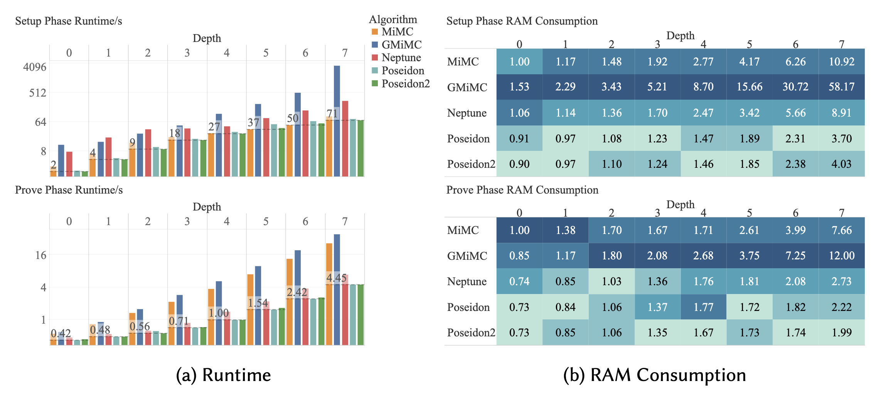
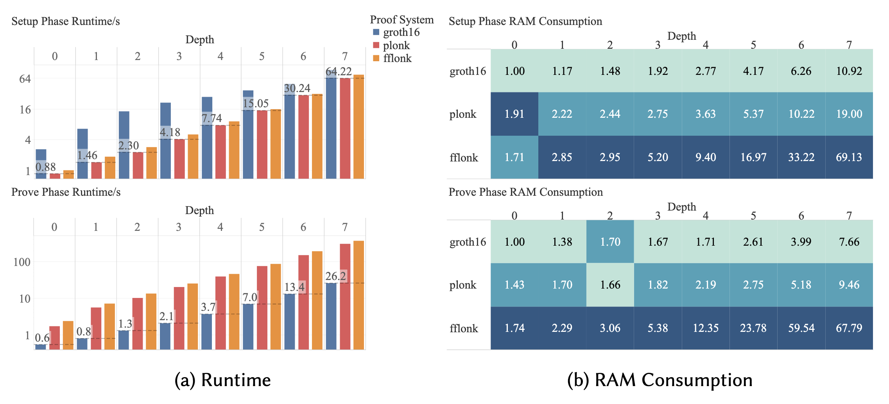
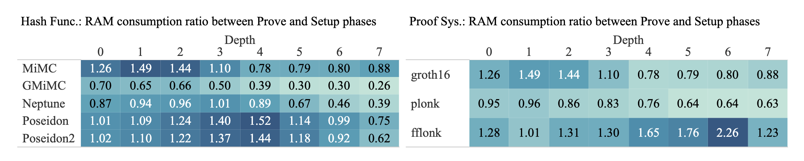

# ZK-Friendly Hash Function Implementation in Circom

This repository contains the Circom implementations of the [GMiMC](https://eprint.iacr.org/2019/397.pdf), [Neptune](https://eprint.iacr.org/2021/1695.pdf), [Poseidon2](https://eprint.iacr.org/2023/323.pdf), and [Rescue](https://eprint.iacr.org/2020/1143) hash functions. Circom is a domain-specific language designed for zero-knowledge proofs. Plain permutation and parameters generation (still need security check) implementation is at `./src` using [ffjavascript v0.3.0](https://github.com/iden3/ffjavascript.git), circuit templates are at `./circuits` using [Circom v2.1.9](https://github.com/iden3/circom.git), and a simple benchmark script written in bash is at `./bench`.

|        | GMiMC | Neptune             | Poseidon2           | Rescue |
| ------ | ----- | ------------------- | ------------------- | ------ |
| Rounds | 226   | 6 full + 68 partial | 8 full + 56 partial | 44     |

## Installation

1. Clone the repo: `git clone https://github.com/hanzeG/zklib_circom.git`

2. Install pre-requisites: `npm i`

3. Download Circom: follow the instructions at [installing Circom](https://docs.circom.io/getting-started/installation/).

4. Download snarkjs: `npm install -g snarkjs`

## Test Hash Functions

1. Test Poseidon2 Permutation with [instance constants](https://github.com/HorizenLabs/poseidon2.git): `npm run test_p2`

2. Test GMiMC Permutation with [instance constants](https://github.com/HorizenLabs/poseidon2.git): `npm run test_g`

3. Test Neptune Permutation with [instance constants](https://github.com/HorizenLabs/poseidon2.git): `npm run test_n`

4. Test Rescue Permutation with [instance constants](https://github.com/fluidex/rescue-hash-js.git): `npm run test_r`

## Benchmark

1. Benchmark in *groth16*: `bash ./bench/groth16.sh`

2. Benchmark in *plonk*: `bash ./bench/plonk.sh`

3. Benchmark in *fflonk*: `bash ./bench/fflonk.sh`

### Benchmarking ZK-Friendly Hash Functions

The below Figure *(a)* shows the relationship between the runtime of the setup and prove phases in *groth16* proof system and the depth of the Merkle tree for circuit templates containing five types of ZK-friendly hash functions. In each template for different Merkle tree depths, the runtime of the most efficient hash function is highlighted. Figure *(b)* illustrates the ratio of memory consumption among these different hash function circuit templates at various Merkle tree depths. The memory consumption of a single *MiMC* at depth 0 is set as the baseline value of 1. In each pane, resource-intensive tests are shown in dark colors, while efficient ones are in light colors.

### Benchmarking Proof Systems

The below Figure *(a)* shows the relationship between the runtime of the setup and prove phases and the depth of the Merkle tree for *MiMC* hash function circuit templates across three proof systems. In each template for different Merkle tree depths, the runtime of the most efficient hash function is highlighted. Figure *(b)* illustrates the ratio of memory consumption among these test circuits running on different proof systems at various Merkle tree depths. The memory consumption of a single *MiMC* in *groth16* at depth 0 is set as the baseline value of 1.

### Prove/ Setup Phase RAM Consumption

The below left chart shows the ratio of RAM consumption during the prove phase to the RAM consumption during the setup phase for circuit templates containing five types of ZK-friendly hash functions in *groth16* at different Merkle tree depths. The right chart shows the same ratio for *MiMC* hash function circuit templates across three proof systems at different Merkle tree depths. In each pane, resource-intensive tests are shown in dark colors, while efficient ones are in light colors.

