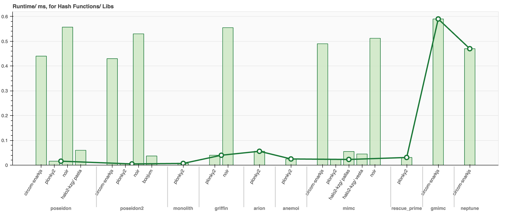
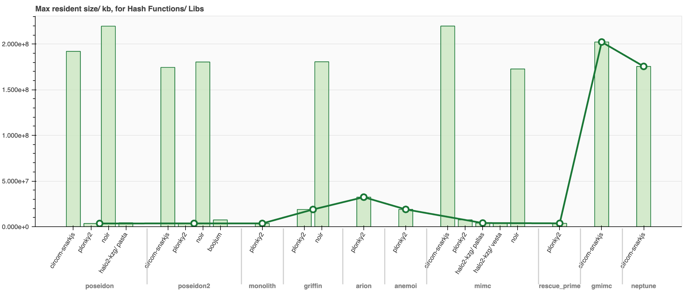
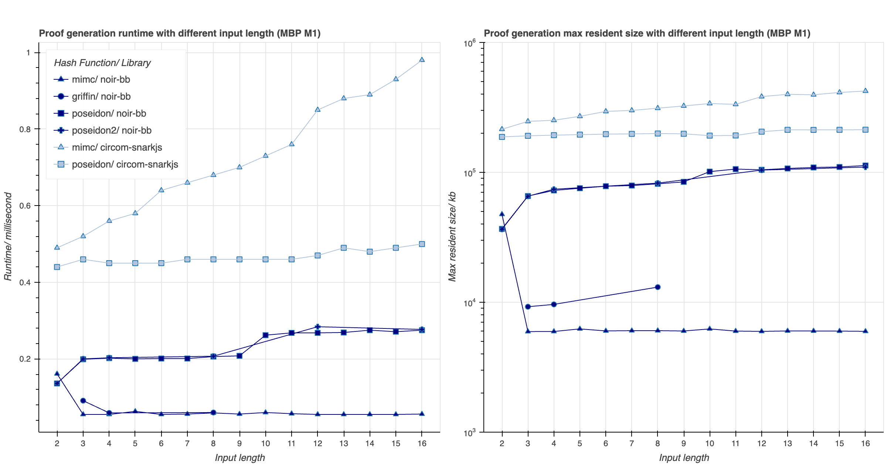
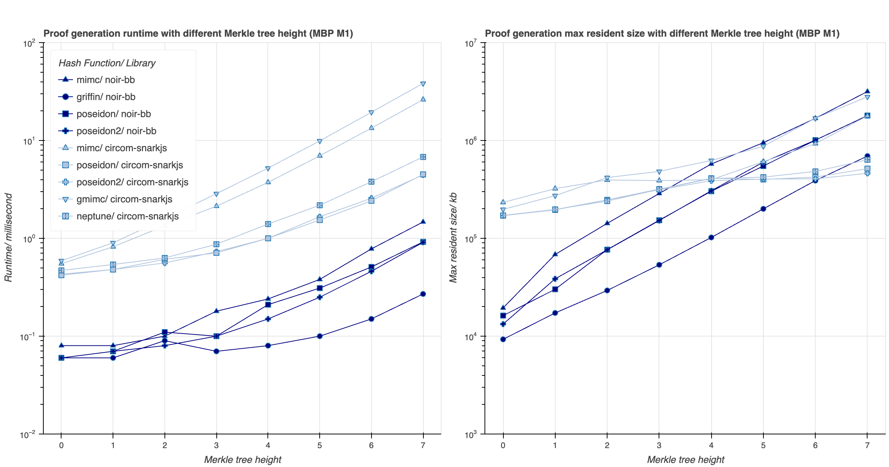
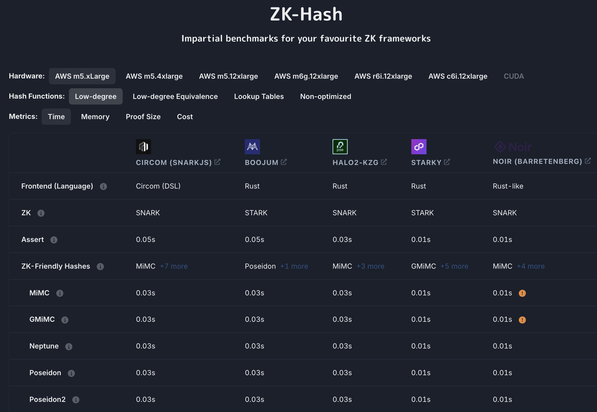

# ZKP Benchmark Toolkit
This ongoing work aims to implement a ZKP Benchmark Toolkit at the ZK circuit level, focused on ZK-friendly hash functions. It enables comparative evaluations across three dimensions: between different ZK development libraries, the operation modes of multiple hash functions (such as varying input lengths and working modes like sponge mode and permutation mode), and multiple security constant constructions. The current experimental samples cover 10 efficient hash functions implemented in over ten libraries. These include support for backend proof systems like groth16, plonk, and Barretenberg (bb), as well as five popular frameworks—circom-snarkjs, halo2-kzg, boojum, plonky2, and noir-bb—based on curves such as bn254, vesta, and pallas.

## Benchmark
The current benchmarking focuses on two key metrics during the proof generation phase: runtime and peak resident set size. The chart below illustrates the runtime consumption during the proof phase for the circuit performing a single hash operation for ten different hash functions. In the scatter plots, we mark the most efficient implementation case for each hash function. We observed that the Plonky2 framework performs exceptionally well in most cases. Although hash functions are continuously evolving in theory (for example, the performance of Poseidon2 implemented in Noir surpasses that of Poseidon), implementation optimisations prove to be more critical when comparing across different frameworks.

The chart below, showing the peak resident set size during the proof generation process, reveals similar findings. Frameworks based on STARK, such as Plonky2 and Boojum, demonstrate memory-efficient characteristics compared to SNARK-based frameworks like Noir and Circom. However, these frameworks trade off other features, such as proof succinctness. For instance, Plonky2’s proof size when executing the MiMC hash function reaches as high as 7664 KB, significantly larger than the sub-1 KB proof size produced by Snarkjs under the same conditions.

Due to the differences in implementation processes across various libraries, the range of statistics is not fully aligned yet. Additionally, the results in the chart only cover a limited number of hash function implementations, excluding the dimensions of multiple operation modes and multiple security constant constructions. These limitations are left for future work to address.

The chart above provides benchmark results of runtime and peak resident set size for various hash functions implemented in two frameworks, offering complete security constants for different input lengths. The goal is to explore how input length, as an independent variable, impacts the performance of specific hash functions. The Noir-bb framework shows significant superiority over Circom-Snarkjs, with Noir’s standard library implementation of the MiMC hash function exhibiting the most efficient time and resource usage, further validating the importance of optimisation in the implementation process.

We extended the analysis by testing these hash functions on a new experimental vector: simulating the construction of fully balanced Merkle trees of specific heights. This test offers more practical relevance compared to the previous single-hash operation experiments in everyday application scenarios. The results shown in the above chart reveal that Noir-bb continues to outperform in terms of time efficiency. However, its advantage in peak resident set size diminishes as the Merkle tree height increases.​

## Getting Started

### Prerequisites

- Install [`Rust`](https://www.rust-lang.org/tools/install)
- Install [`Nargo`](https://noir-lang.org/docs/getting_started/installation/)
- Install [`Circom`](https://github.com/iden3/circom)

### Benchmark

- `git clone https://github.com/hanzeG/zkp-benchmark.git`
- `cd zkp-benchmark`

Each framework’s test case has a script file for benchmarking. After navigating to the corresponding directory, run `./run.sh`.

### Front-end

- `cd site`
- `npm run dev`
- Open http://localhost:3000 with your browser to see the result.

Considering the continuous integrability of this work, front-end development is also part of future tasks. The goal is to provide developers with an intuitive interface that visually presents comprehensive metrics for evaluating circuit use cases. This will enable a more accessible and transparent assessment of performance across different implementations.